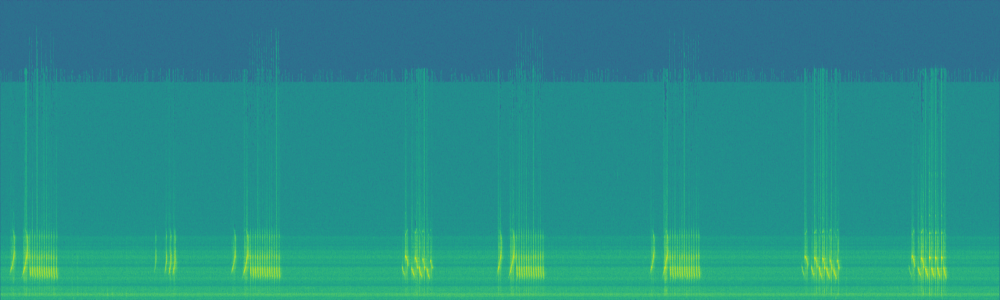

# Bioacoustic Species Identification for Biodiversity Monitoring
Species identification from audio, focused on birds, amphibians, mammals and insects. Supports biodiversity monitoring through machine learning.

## Research Notes
This repository represents ongoing independent research exploration.

Detailed methodology: [docs/methodology.md](docs/methodology.md)

## Research Overview
This project investigates deep learning approaches for
bioacoustic species identification using environmental
audio recordings.

The work explores multimodal AI applications for
ecological monitoring and biodiversity analysis.

## Research Motivation
Automated biodiversity monitoring enables scalable
environmental research and conservation efforts.

## Research Questions
- Can audio models reliably identify species in noisy environments?
- Which representations capture ecological acoustic patterns?
- How can models generalize across habitats?

## Approach
Spectrogram feature extraction and classification models
evaluated on publicly available ecological datasets.

## Limitations
Environmental noise and class imbalance impact performance.
Geographic generalization remains challenging.

## Data Pipeline (High Level)
- Load audio → resample/normalize
- Convert to time-frequency representation (e.g., mel-spectrogram)
- Apply augmentations (noise, time/freq masking)
- Train classifier and evaluate on held-out splits

## Generalization Considerations
Performance may degrade across new habitats, recording devices, or seasonal soundscapes. Domain shift is a core limitation and a key future research direction.

## Dataset Intuition (Spectrogram Example)

Below is a representative spectrogram visualization derived from a public bioacoustic benchmark. Bioacoustic signals are often embedded in complex soundscapes (wind, rain, insects, overlapping species), which makes the classification problem non-trivial.

## Dataset Intuition (Spectrogram Example)

Domain shift is a key challenge: models trained on one geography, season, or recorder type may degrade when deployed in different habitats or acoustic conditions.

*Figure: Representative spectrogram visualization.

Note: This repository does not redistribute datasets. It includes only derived visualizations for explanatory purposes.

